# Flujo Completo de Mantenimiento - GH-Gestion

> Actualizado: 2026-02-09
> Basado en: Proceso Manten. Rev 1.pptx (06/10/25 REV 01) + redefinicion de flujo post-taller

---

## Leyenda

```
✅ = Implementado
🟡 = Parcial
⬜ = Pendiente
```

---

## Diagrama de Flujo Completo (Mermaid)

```mermaid
flowchart TD
    %% ============================================
    %% ORIGEN DEL DESVIO
    %% ============================================
    subgraph ORIGEN["ORIGEN DEL DESVIO"]
        direction TB
        A1[/"Chofer escanea QR del equipo"/]
        A2["Completa Checklist"]
        A3{"Hay desvios<br/>criticos?"}
        A4["Modal: Asigna supervisor<br/>+ comentarios por desvio"]
        A5[("maintenance_request<br/>status: pending_approval<br/>source: checklist")]

        B1["Pedido manual<br/>Tab: Nuevo Pedido"]
        B2[("maintenance_request<br/>status: pending_approval<br/>source: manual")]

        C1["Tab: Equipos con Desvios"]
        C2[("maintenance_request<br/>status: pending_approval")]

        A1 --> A2 --> A3
        A3 -- "Si" --> A4 --> A5
        A3 -- "No" --> FIN_CHECK["Sin desvios"]
        B1 --> B2
        C1 --> C2
    end

    %% ============================================
    %% VALIDACION
    %% ============================================
    subgraph VALIDACION["OPERACIONES: Pendientes de Validar"]
        direction TB
        V1["Supervisor revisa solicitud<br/>filtrada por supervisor_id"]
        V2{"Aprueba/rechaza<br/>cada item"}
        V3{"Al menos 1<br/>item aprobado?"}
        V4[("request -> approved<br/>SE CREA maintenance_order<br/>status: pending_scheduling")]
        V5[("request -> rejected")]

        V1 --> V2 --> V3
        V3 -- "Si" --> V4
        V3 -- "No" --> V5
    end

    %% ============================================
    %% TALLER: PLANIFICAR FECHA
    %% ============================================
    subgraph PLANIFICAR_FECHA["TALLER: Pedidos Pendientes"]
        direction TB
        PF1["Taller asigna<br/>fecha planificada"]
        PF2[("maintenance_order<br/>status: scheduled")]

        PF1 --> PF2
    end

    %% ============================================
    %% APROBACION DE FECHA
    %% ============================================
    subgraph APROB_FECHA["OPERACIONES: Aprobacion de Fecha"]
        direction TB
        AF1["Supervisor ve pedidos<br/>con fecha asignada"]
        AF2{"Aprueba<br/>la fecha?"}
        AF3[("status: date_confirmed")]
        AF4[("status: pending_scheduling<br/>scheduled_date: NULL")]

        AF1 --> AF2
        AF2 -- "Aprobar" --> AF3
        AF2 -- "Rechazar con motivo" --> AF4
    end

    %% ============================================
    %% PARA TALLER
    %% ============================================
    subgraph PARA_TALLER["OPERACIONES: Para Taller"]
        direction TB
        PT1["Aprueba entrada al taller<br/>Ingresa kilometraje"]
        PT2[("status: in_workshop<br/>Equipo -> NO OPERATIVO")]

        PT1 --> PT2
    end

    %% ============================================
    %% OPERACIONES: SEGUIMIENTO
    %% ============================================
    subgraph SEGUIMIENTO_OPS["OPERACIONES: Seguimiento en Taller"]
        direction TB
        SO1["Operaciones puede ver:<br/>- Estado del equipo en taller<br/>- Sector actual del equipo<br/>- Tareas completadas/pendientes<br/>- Orden de ejecucion de sectores"]
        SO2["Vista de solo lectura<br/>para dar seguimiento"]

        SO1 --> SO2
    end

    %% ============================================
    %% JEFE DE TALLER
    %% ============================================
    subgraph JEFE_TALLER["TALLER: Jefe de Taller"]
        direction TB
        JT1["Ve todos los pedidos<br/>status: in_workshop"]
        JT2["Revisa items del pedido<br/>puede agregar items nuevos"]
        JT3["Se agrega tarea DIAGNOSTICO<br/>por defecto a cada orden<br/>BLOQUEA las demas tareas"]

        JT4["Asigna items a sectores<br/>con ORDEN de ejecucion"]
        JT5["Ej: 3 items -> Sector Electricidad<br/>orden: 1ro"]
        JT6["Ej: 4 items -> Sector Mecanica<br/>orden: 2do"]

        JT7[("Se crea ORDEN DE MANTENIMIENTO<br/>con asignaciones a sectores<br/>+ secuencia de ejecucion<br/>+ tarea Diagnostico incluida")]

        JT1 --> JT2 --> JT3 --> JT4
        JT4 --> JT5
        JT4 --> JT6
        JT5 --> JT7
        JT6 --> JT7
    end

    %% ============================================
    %% BANDEJA JEFE TALLER: APROBACIONES
    %% ============================================
    subgraph APROBACIONES_JT["JEFE DE TALLER: Bandeja de Aprobaciones"]
        direction TB
        AJT1{"Que llego?"}

        AJT2["Tarea nueva del operario<br/>que REQUIERE autorizacion"]
        AJT3{"Aprueba?"}
        AJT4["Tarea aprobada<br/>-> vuelve al sector"]
        AJT5["Tarea rechazada"]

        AJT6["Tarea devuelta por operario<br/>sector incorrecto"]
        AJT7["Jefe de Taller reasigna<br/>al sector correcto"]

        AJT1 -- "Tarea nueva<br/>autorizable" --> AJT2 --> AJT3
        AJT3 -- "Si" --> AJT4
        AJT3 -- "No" --> AJT5
        AJT1 -- "Tarea devuelta<br/>sector incorrecto" --> AJT6 --> AJT7
    end

    %% ============================================
    %% SECTOR: OPERARIO (FLUJO FUTURO)
    %% ============================================
    subgraph SECTOR["SECTOR: Operario de Taller - futuro"]
        direction TB
        S0["Operario ve orden de<br/>mantenimiento asignada a su sector"]
        S1["Debe completar DIAGNOSTICO<br/>antes que cualquier otra tarea"]
        S2{"Diagnostico<br/>completado"}
        S3{"Detecto una<br/>falla adicional?"}
        S4_YES["Agregar tarea nueva"]
        S4_NO["Continuar con<br/>las demas tareas"]
        S5{"La tarea requiere<br/>autorizacion?"}
        S6_YES["Tarea viaja al<br/>Jefe de Taller<br/>para aprobacion"]
        S6_NO["Tarea agregada<br/>directamente<br/>sin aprobacion"]
        S7["Ejecuta tareas restantes"]
        S8{"Durante la ejecucion<br/>detecta otra falla?"}
        S9["Puede agregar tarea<br/>en cualquier momento<br/>mismo flujo de autorizacion"]
        S10{"La tarea es<br/>de otro sector?"}
        S11["Marca tarea como<br/>sector incorrecto<br/>-> vuelve al Jefe de Taller"]
        S12["Completa todas<br/>las tareas del sector"]
        S13{"Hay siguiente<br/>sector en la<br/>secuencia?"}
        S14["Equipo pasa al<br/>siguiente sector"]
        S15["Orden de mantenimiento<br/>COMPLETADA"]

        S0 --> S1 --> S2
        S2 --> S3
        S3 -- "Si" --> S4_YES --> S5
        S3 -- "No" --> S4_NO --> S7
        S5 -- "Autorizable" --> S6_YES
        S5 -- "No autorizable" --> S6_NO --> S7
        S7 --> S8
        S8 -- "Si" --> S9 --> S5
        S8 -- "No" --> S10
        S10 -- "Si, es de otro sector" --> S11
        S10 -- "No, es mia" --> S12
        S12 --> S13
        S13 -- "Si" --> S14
        S13 -- "No, era el ultimo" --> S15
    end

    %% ============================================
    %% CONEXIONES PRINCIPALES
    %% ============================================
    A5 --> V1
    B2 --> V1
    C2 --> V1

    V4 --> PF1
    V5 -.-> FIN_RECHAZADO["Solicitud rechazada"]

    PF2 --> AF1
    AF3 --> PT1
    AF4 --> PF1

    PT2 --> JT1
    PT2 -.-> SO1

    JT7 --> S0
    JT7 -.-> SO1

    S6_YES --> AJT2
    AJT4 --> S7
    S11 --> AJT6
    AJT7 --> S0
    S14 --> S0

    S15 --> FIN_COMPLETADO["Orden de mantenimiento completada<br/>Equipo puede volver a operativo"]
```



---

## Detalle por Fase

### FASE 1 - Origen del Desvio ✅ COMPLETA

| Paso | Actor      | Descripcion                                              | Estado |
| ---- | ---------- | -------------------------------------------------------- | ------ |
| 1    | Chofer     | Escanea QR del equipo                                    | ✅     |
| 2    | Chofer     | Completa checklist                                       | ✅     |
| 3    | Chofer     | Si hay desvios criticos: asigna supervisor + comentarios | ✅     |
| 4    | Sistema    | Crea `maintenance_request` con status `pending_approval` | ✅     |
| Alt. | Usuario    | Puede crear pedido manual desde tab "Nuevo Pedido"       | ✅     |
| Alt. | Supervisor | Puede crear solicitud desde tab "Equipos con Desvios"    | ✅     |

### FASE 2 - Validacion por Supervisor ✅ COMPLETA

| Paso | Actor      | Descripcion                                                                      | Estado |
| ---- | ---------- | -------------------------------------------------------------------------------- | ------ |
| 5    | Supervisor | Revisa solicitud (filtrada por `supervisor_id`)                                  | ✅     |
| 6    | Supervisor | Aprueba/rechaza cada item individualmente                                        | ✅     |
| 7    | Sistema    | Si hay items aprobados: crea `maintenance_order` con status `pending_scheduling` | ✅     |

### FASE 3 - Planificacion de Fecha ✅ COMPLETA

| Paso | Actor   | Descripcion                        | Estado |
| ---- | ------- | ---------------------------------- | ------ |
| 8    | Taller  | Asigna fecha planificada al pedido | ✅     |
| 9    | Sistema | Pedido pasa a status `scheduled`   | ✅     |

### FASE 4 - Aprobacion de Fecha ✅ COMPLETA

| Paso | Actor                    | Descripcion                                              | Estado |
| ---- | ------------------------ | -------------------------------------------------------- | ------ |
| 10   | Supervisor (Operaciones) | Ve pedidos con fecha asignada                            | ✅     |
| 11   | Supervisor               | Aprueba fecha → `date_confirmed`                         | ✅     |
| 11b  | Supervisor               | Rechaza fecha con motivo → vuelve a `pending_scheduling` | ✅     |

### FASE 5 - Entrada a Taller ✅ COMPLETA

| Paso | Actor       | Descripcion                                     | Estado |
| ---- | ----------- | ----------------------------------------------- | ------ |
| 12   | Operaciones | Aprueba entrada al taller + ingresa kilometraje | ✅     |
| 13   | Sistema     | Pedido → `in_workshop`, equipo → `no operativo` | ✅     |

### FASE 6 - Jefe de Taller: Gestion de Orden de Mantenimiento ⬜ PENDIENTE

| Paso | Actor          | Descripcion                                               | Estado |
| ---- | -------------- | --------------------------------------------------------- | ------ |
| 14   | Jefe de Taller | Ve todos los pedidos `in_workshop`                        | ⬜     |
| 15   | Jefe de Taller | Revisa items del pedido, puede agregar items nuevos       | ⬜     |
| 16   | Sistema        | Agrega tarea DIAGNOSTICO por defecto (bloquea las demas)  | ⬜     |
| 17   | Jefe de Taller | Asigna items a sectores con ORDEN de ejecucion secuencial | ⬜     |
| 18   | Sistema        | Crea orden de mantenimiento con asignaciones + secuencia  | ⬜     |

**Reglas criticas de esta fase:**

- Cada orden de mantenimiento tiene una tarea **DIAGNOSTICO obligatoria** que bloquea todas las demas tareas
- Los items se agrupan por sector con un **orden de ejecucion secuencial** (ej: 1ro Electricidad, 2do Mecanica)
- El Sector B **NO puede empezar** hasta que el Sector A complete todas sus tareas
- El Jefe de Taller puede agregar items que no venian en la solicitud original

### FASE 7 - Bandeja de Aprobaciones del Jefe de Taller ⬜ PENDIENTE

| Paso | Actor          | Descripcion                                                    | Estado |
| ---- | -------------- | -------------------------------------------------------------- | ------ |
| 19   | Jefe de Taller | Recibe tareas nuevas que requieren autorizacion (del operario) | ⬜     |
| 20   | Jefe de Taller | Aprueba → tarea vuelve al sector / Rechaza → tarea descartada  | ⬜     |
| 21   | Jefe de Taller | Recibe tareas devueltas por sector incorrecto                  | ⬜     |
| 22   | Jefe de Taller | Reasigna tarea al sector correcto                              | ⬜     |

### FASE 8 - Ejecucion en Sector (Operario de Taller) ⬜ PENDIENTE (futuro)

| Paso | Actor    | Descripcion                                                          | Estado |
| ---- | -------- | -------------------------------------------------------------------- | ------ |
| 23   | Operario | Ve orden de mantenimiento asignada a su sector                       | ⬜     |
| 24   | Operario | Debe completar DIAGNOSTICO antes que cualquier otra tarea            | ⬜     |
| 25   | Sistema  | Al completar diagnostico: pregunta si detecto falla adicional        | ⬜     |
| 26a  | Operario | Si detecta falla: agrega tarea nueva (flujo de autorizacion)         | ⬜     |
| 26b  | Operario | Si no detecta falla: continua con las demas tareas                   | ⬜     |
| 27   | Operario | Puede agregar tareas en cualquier momento (mismo flujo autorizacion) | ⬜     |
| 28   | Operario | Puede marcar tarea como "sector incorrecto" → vuelve al Jefe         | ⬜     |
| 29   | Operario | Completa todas las tareas de su sector                               | ⬜     |
| 30   | Sistema  | Si hay siguiente sector en secuencia → equipo pasa al siguiente      | ⬜     |
| 31   | Sistema  | Si era el ultimo sector → orden de mantenimiento COMPLETADA          | ⬜     |

---

## Flujo de Autorizacion de Tareas

Cuando un operario agrega una tarea nueva a una orden de mantenimiento:

```
Operario quiere agregar tarea
        |
        v
  La tarea (tipo de reparacion)
  tiene campo "autorizable"?
        |
   +---------+---------+
   |                   |
   v                   v
 SI, autorizable     NO, libre
   |                   |
   v                   v
 Tarea viaja al     Tarea se agrega
 Jefe de Taller     directamente al
 para aprobacion    sector y se puede
   |                ejecutar
   v
 Jefe aprueba?
   |
  +-----+-----+
  |           |
  v           v
 SI          NO
  |           |
  v           v
Tarea vuelve  Tarea
al sector     rechazada
```

---

## Flujo de Tarea en Sector Incorrecto

Cuando un operario detecta que una tarea no corresponde a su sector:

```
Operario recibe tarea
        |
        v
  Esta tarea es de mi sector?
        |
   +--------+--------+
   |                 |
   v                 v
  SI               NO
   |                 |
   v                 v
 Ejecuta         Marca como
 normalmente     "sector incorrecto"
                     |
                     v
                 Tarea vuelve al
                 Jefe de Taller
                     |
                     v
                 Jefe reasigna
                 al sector correcto
```

---

## Concepto: Secuencia de Sectores

Una orden de mantenimiento puede abarcar multiples sectores con un **orden secuencial obligatorio**:

```
Orden de Mantenimiento #123
|
+-- Sector Electricidad (orden: 1)
|   +-- Tarea: Diagnostico (obligatoria, bloquea el resto)
|   +-- Tarea: Revision sistema electrico
|   +-- Tarea: Cambio de alternador
|
+-- Sector Mecanica (orden: 2) -- BLOQUEADO hasta que Electricidad termine
|   +-- Tarea: Diagnostico (obligatoria, bloquea el resto)
|   +-- Tarea: Cambio de correa
|   +-- Tarea: Revision de frenos
|   +-- Tarea: Cambio de aceite
|
+-- Sector Pintura (orden: 3) -- BLOQUEADO hasta que Mecanica termine
    +-- Tarea: Diagnostico (obligatoria, bloquea el resto)
    +-- Tarea: Pintura de carroceria
```

**Reglas:**

- Cada sector tiene su propia tarea DIAGNOSTICO que bloquea las demas tareas del sector
- Un sector NO puede empezar hasta que el sector anterior en la secuencia complete todas sus tareas
- Operaciones puede ver en tiempo real: en que sector esta el equipo, cuantas tareas faltan, etc.

---

## Cambio en Tipos de Reparacion

Los tipos de reparacion (`types_of_repairs`) requieren un **nuevo campo**:

| Campo         | Tipo    | Descripcion                                                                            |
| ------------- | ------- | -------------------------------------------------------------------------------------- |
| `autorizable` | boolean | Si la tarea requiere autorizacion del Jefe de Taller para ser agregada por un operario |

**Impacto:**

- Si `autorizable = true`: cuando un operario agrega esta tarea, viaja al Jefe de Taller para aprobacion
- Si `autorizable = false`: el operario puede agregarla y ejecutarla directamente sin paso extra

---

## Estados del Sistema

### Solicitud de Mantenimiento (SM) ✅

| Estado             | Descripcion                         | Implementado |
| ------------------ | ----------------------------------- | ------------ |
| `pending_approval` | Esperando validacion del supervisor | ✅           |
| `approved`         | Aprobada, se genera PM              | ✅           |
| `rejected`         | Rechazada con justificacion         | ✅           |

### Pedido de Mantenimiento (PM) 🟡

| Estado               | Descripcion                                 | Implementado |
| -------------------- | ------------------------------------------- | ------------ |
| `pending_scheduling` | Pendiente de planificacion por Taller       | ✅           |
| `scheduled`          | Fecha planificada, esperando aprobacion     | ✅           |
| `date_confirmed`     | Fecha aprobada por supervisor               | ✅           |
| `in_workshop`        | En taller, pendiente asignacion de sectores | ✅           |
| `completed`          | Todas las ordenes cerradas                  | ⬜           |
| `rejected`           | Rechazado                                   | ✅           |

### Orden de Mantenimiento (OM) ⬜ POR REDEFINIR

| Estado        | Descripcion                               | Implementado |
| ------------- | ----------------------------------------- | ------------ |
| `pending`     | Creada, pendiente de ejecucion            | ⬜           |
| `in_progress` | Al menos un sector en ejecucion           | ⬜           |
| `completed`   | Todos los sectores completaron sus tareas | ⬜           |
| `cancelled`   | Cancelada                                 | ⬜           |

### Asignacion a Sector ⬜ POR IMPLEMENTAR

| Estado        | Descripcion                              | Implementado |
| ------------- | ---------------------------------------- | ------------ |
| `blocked`     | Esperando que el sector anterior termine | ⬜           |
| `pending`     | Sector habilitado, esperando ejecucion   | ⬜           |
| `in_progress` | Operario ejecutando tareas del sector    | ⬜           |
| `completed`   | Todas las tareas del sector completadas  | ⬜           |

### Tarea (dentro de un sector) ⬜ POR IMPLEMENTAR

| Estado             | Descripcion                                           | Implementado |
| ------------------ | ----------------------------------------------------- | ------------ |
| `blocked`          | Bloqueada por diagnostico pendiente                   | ⬜           |
| `pending`          | Disponible para ejecutar                              | ⬜           |
| `pending_approval` | Esperando aprobacion del Jefe de Taller (autorizable) | ⬜           |
| `wrong_sector`     | Devuelta al Jefe de Taller por sector incorrecto      | ⬜           |
| `in_progress`      | En ejecucion                                          | ⬜           |
| `completed`        | Completada                                            | ⬜           |
| `rejected`         | Rechazada por Jefe de Taller                          | ⬜           |

### Equipo/Vehiculo ✅

| Condicion      | Descripcion                   | Implementado |
| -------------- | ----------------------------- | ------------ |
| `operativo`    | Disponible para operaciones   | ✅           |
| `no operativo` | En taller o fuera de servicio | ✅           |

---

## Visibilidad por Rol

### Tab OPERACIONES (rol: Operaciones/Supervisor)

| Subtab                    | Que ve                                                  | Acciones               |
| ------------------------- | ------------------------------------------------------- | ---------------------- |
| Equipos con Desvios       | Equipos con desvios pendientes                          | Crear solicitud        |
| Pendientes de Validar     | Solicitudes `pending_approval`                          | Aprobar/rechazar items |
| Aprobacion de Fecha       | Pedidos `scheduled`                                     | Aprobar/rechazar fecha |
| Para Taller               | Pedidos `date_confirmed`                                | Aprobar entrada + km   |
| Nuevo Pedido              | Formulario                                              | Crear pedido manual    |
| **Seguimiento en Taller** | **Estado del equipo, sector actual, tareas, secuencia** | **Solo lectura**       |

### Tab TALLER (rol: Jefe de Taller)

| Subtab                      | Que ve                                     | Acciones                                      |
| --------------------------- | ------------------------------------------ | --------------------------------------------- |
| Pedidos Pendientes          | Pedidos `pending_scheduling`               | Asignar fecha                                 |
| Pedidos Confirmados         | Pedidos `date_confirmed`                   | Ver/preparar                                  |
| **Gestion de Ordenes**      | **Pedidos `in_workshop`**                  | **Agregar items, asignar sectores, crear OM** |
| **Bandeja de Aprobaciones** | **Tareas pendientes de aprobar/reasignar** | **Aprobar, rechazar, reasignar sector**       |
| Ordenes de Trabajo          | Ordenes activas                            | Ver estado, historial                         |
| Configuracion               | Tipos de reparacion, grupos                | CRUD                                          |

### Tab SECTOR (rol: Operario de Taller) - FUTURO

| Vista          | Que ve                        | Acciones                               |
| -------------- | ----------------------------- | -------------------------------------- |
| Mis Ordenes    | Ordenes asignadas a su sector | Completar diagnostico, ejecutar tareas |
| Agregar Tarea  | Formulario                    | Agregar tarea (con/sin autorizacion)   |
| Devolver Tarea | Formulario                    | Marcar tarea como sector incorrecto    |

---

## Cambios respecto al flujo anterior

| Aspecto                    | Antes                                                     | Ahora                                                                            |
| -------------------------- | --------------------------------------------------------- | -------------------------------------------------------------------------------- |
| Despues de `in_workshop`   | Planificacion asignaba taller + sector + tipos reparacion | **Jefe de Taller** gestiona todo desde su bandeja                                |
| Tarea Diagnostico          | No existia                                                | **Obligatoria por defecto**, bloquea el resto                                    |
| Asignacion a sectores      | Items se asignaban individualmente                        | Items se agrupan por sector con **orden de ejecucion secuencial**                |
| Sector B espera a Sector A | No habia concepto de secuencia                            | **Sector B no puede empezar hasta que Sector A termine**                         |
| Agregar tareas             | No se podia                                               | Operario puede agregar, con flujo de **autorizacion si la tarea es autorizable** |
| Tarea en sector incorrecto | No existia                                                | Operario la **devuelve al Jefe de Taller** para reasignar                        |
| Tipos de reparacion        | Sin campo de autorizacion                                 | Nuevo campo: **autorizable (si/no)**                                             |
| Visibilidad Operaciones    | Limitada                                                  | **Seguimiento completo** del equipo en taller (solo lectura)                     |
| Ordenes de trabajo         | Entidad separada                                          | Reemplazadas por **ordenes de mantenimiento** con asignaciones a sectores        |

---

## Puntos de atencion para la visibilidad de Operaciones

1. **Cuando el Jefe de Taller esta aprobando/rechazando tareas nuevas** - Operaciones deberia ver que hay tareas pendientes de aprobacion
2. **Cuando una tarea fue devuelta por sector incorrecto** - Operaciones deberia ver que hay un item en "limbo" esperando reasignacion
3. **Progreso por sector** - Operaciones deberia ver: "Sector Electricidad: 2/3 tareas completadas, Sector Mecanica: pendiente (esperando)"
4. **Diagnostico pendiente** - Si el diagnostico lleva mucho tiempo, Operaciones deberia poder verlo

---

## Roles Involucrados

| Rol                    | Responsabilidades                             | Tab principal        | Implementado |
| ---------------------- | --------------------------------------------- | -------------------- | ------------ |
| **Chofer**             | Escanea QR, completa checklist, genera SM     | Movil `/maintenance` | ✅           |
| **Supervisor**         | Valida/rechaza items de la SM                 | Operaciones          | ✅           |
| **Operaciones**        | Aprueba fechas, entrada a taller, seguimiento | Operaciones          | 🟡           |
| **Jefe de Taller**     | Asigna sectores, aprueba tareas, reasigna     | Taller               | ⬜           |
| **Operario de Taller** | Ejecuta tareas, diagnostico, agrega tareas    | Sector (futuro)      | ⬜           |

---

## Estado de Implementacion

| Funcionalidad                                   | Estado |
| ----------------------------------------------- | ------ |
| Checklist con desvios                           | ✅     |
| Solicitud de Mantenimiento                      | ✅     |
| Validacion por Supervisor                       | ✅     |
| Conversion SM → PM                              | ✅     |
| Planificacion de fecha                          | ✅     |
| Aprobacion de fecha                             | ✅     |
| Entrada a taller + km + condicion               | ✅     |
| Seguimiento de Operaciones en taller            | ⬜     |
| Jefe de Taller: gestion de ordenes              | ⬜     |
| Tarea Diagnostico obligatoria                   | ⬜     |
| Asignacion a sectores con secuencia             | ⬜     |
| Campo `autorizable` en tipos de reparacion      | ⬜     |
| Bandeja de aprobaciones Jefe de Taller          | ⬜     |
| Operario: ejecucion de tareas                   | ⬜     |
| Operario: agregar tareas (con/sin autorizacion) | ⬜     |
| Operario: devolver tarea por sector incorrecto  | ⬜     |
| Cierre de orden de mantenimiento                | ⬜     |

---

## Proximos Pasos (Prioridad)

| #   | Prioridad | Funcionalidad                                                   |
| --- | --------- | --------------------------------------------------------------- |
| 1   | CRITICO   | Campo `autorizable` en `types_of_repairs`                       |
| 2   | CRITICO   | Tab Jefe de Taller: ver pedidos `in_workshop`, agregar items    |
| 3   | CRITICO   | Tarea DIAGNOSTICO obligatoria por defecto                       |
| 4   | CRITICO   | Asignacion de items a sectores con orden secuencial             |
| 5   | CRITICO   | Creacion de orden de mantenimiento con sectores + secuencia     |
| 6   | CRITICO   | Bandeja de aprobaciones del Jefe de Taller                      |
| 7   | MEDIO     | Seguimiento de Operaciones (vista lectura del estado en taller) |
| 8   | MEDIO     | Operario: vista de ordenes asignadas a su sector                |
| 9   | MEDIO     | Operario: completar diagnostico + prompt agregar tarea          |
| 10  | MEDIO     | Operario: agregar tarea con flujo de autorizacion               |
| 11  | MEDIO     | Operario: devolver tarea por sector incorrecto                  |
| 12  | BAJO      | Cierre completo de orden de mantenimiento                       |
